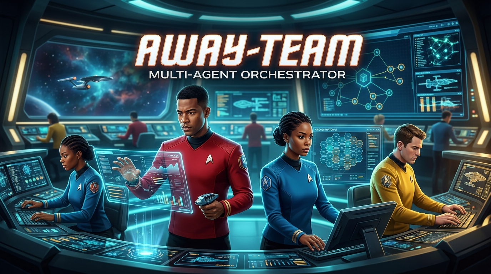

# away-team

An orchestrator that beams down a crew of specialist agents to fix a bug: map the codebase, find the root cause, bash the bug, open the PR. Built for GitHub Copilot (CLI and desktop app) and Claude Code (CLI and desktop app), installed user-level so it works in every repo and every language.

The point is spending fewer tokens on bug work without losing quality. Six things do that:

1. **Right model per job.** Each agent declares a tier (cheap, balanced, strong) rather than a model. Reading a repo is cheap-tier work; root-causing is the one place the strong tier pays for itself.
2. **Narrow, read-only specialists.** The investigator cannot edit and the orchestrator cannot run code, so each context window holds only what that job needs. On Claude Code the investigator's read-only-ness is enforced by a hook, not trusted to the prompt.
3. **Small reports, never retyped.** Output costs about five times input. Each specialist returns one fixed report of a few hundred tokens, or a `## Blocked` block (stage, reason, what it tried, side effects, next cheapest step, what it needs) when it cannot finish. The orchestrator shows you four lines of it, forwards it verbatim once to the one specialist that needs it, and gives you the full text only if you ask. Nothing is re-verified downstream, and nobody improvises when stuck: blocked means nothing was changed.
4. **A persistent code map.** `docs/CODEMAP.md` is written once and refreshed by diff, so agents stop re-reading the repo every session.
5. **A context budget per agent.** Batch tool calls, since every turn re-reads the agent's whole context. Search before reading, read windows not files, run one test not the suite, cap command output, skip vendored trees. On Claude Code each specialist also carries a `maxTurns` cap, so a runaway investigation returns partial output instead of burning the window. The orchestrator is the only long-lived context, so it reads almost nothing itself, holds only the latest reports, and suggests a fresh session per bug.
6. **Ponytail and caveman.** Optional companions that shrink what the agent builds and what it says.

```
agents/
  away-team.agent.md                pick this one; it routes to the others
  away-team-mapper.agent.md         writes docs/CODEMAP.md
  away-team-investigator.agent.md   read-only root cause → Diagnosis
  away-team-basher.agent.md         Diagnosis → failing test → minimal fix → commit
  away-team-pr-writer.agent.md      branch → PR (TL;DR body, breakdown in comments)
skills/
  codemap/SKILL.md        CODEMAP.md template + rules
  pr-format/SKILL.md      PR template + gh commands
hooks/readonly-guard.js   PreToolUse hook that enforces the investigator's read-only tool set
                          (the plugin wires it from a generated hooks/hooks.json, scoped by agent name)
bin/away-team.js          installer; also renders dist/ for the plugin marketplaces
test/build-output.test.js asserts over dist/ after a build; npm test
dist/copilot, dist/claude prebuilt plugins (generated, committed)
```

## Install

**npx** (Windows, Mac, Linux; installs ponytail and caveman too):

```bash
npx @scotscottmca/away-team                          # detects Copilot / Claude Code, asks which to install to
npx @scotscottmca/away-team --target claude          # copilot | claude | all, skips that prompt
npx @scotscottmca/away-team --scope project          # into this repo: .github/ (Copilot), .claude/ (Claude Code)
npx @scotscottmca/away-team --yes                    # accept every default, no prompts
npx @scotscottmca/away-team --skip-plugins
npx @scotscottmca/away-team --level full             # ponytail + caveman default level (ultra)
npx @scotscottmca/away-team --mcp jira,github        # extra MCP servers, on top of the ones found on this machine
npx @scotscottmca/away-team --no-mcp                 # no MCP at all; smaller cold start
npx github:scotscottmca/away-team                    # same, straight from GitHub
```

**Plugin marketplaces** (agents and skills only; ponytail and caveman are separate, see below):

```bash
copilot plugin marketplace add scotscottmca/away-team
copilot plugin install away-team@away-team

claude plugin marketplace add scotscottmca/away-team
claude plugin install away-team@away-team
```

**Per repo**: run the installer inside a git repo and pick **Project** scope (or `--scope project`). It writes the agents and skills to `.github/` for Copilot and `.claude/` for Claude Code, to commit with the code. Teammates then get them with no install, and the Copilot cloud agent on github.com can use them. Ponytail, caveman and the level setting are per user and stay with the global install. Default is Global. One condition on Claude Code: the repo folder must be trusted (accept the trust dialog the first time Claude Code opens there), or it skips the hooks in `.claude/agents/` and the investigator's read-only guard is silent; `claude --debug` logs `Skipping frontmatter hooks ... not trusted` when that is the case.

What the npx install writes:

| | Copilot | Claude Code |
|---|---|---|
| agents | `~/.copilot/agents/*.agent.md` | `~/.claude/agents/*.md` |
| skills | `~/.copilot/skills/` | `~/.claude/skills/` (plus `away-team` as a skill) |
| ponytail | `copilot plugin install ponytail@ponytail` | `claude plugin install ponytail@ponytail` |
| caveman | `npx skills add JuliusBrussee/caveman -s caveman` (core skill only; caveman has no Copilot marketplace manifest) | `claude plugin install caveman@caveman` |

## Select away-team

| Platform | How |
|---|---|
| Copilot app / CLI | `/agent` → **away-team**, or `copilot --agent away-team` |
| | Both read the agent list when a chat session starts: after installing, start a new session before looking for it. |
| Claude Code CLI | `claude --agent away-team` (also finds the plugin install; `away-team:away-team` if another plugin ships an `away-team` agent too) |
| Claude Code, any project, always | `"agent": "away-team"` in that project's `.claude/settings.json` |
| Claude desktop app (no agent picker) | `/away-team <your request>` (plugin install: `/away-team:away-team`) |

Any worker can be selected directly too (`/agent` → away-team-mapper, and so on). In Claude Code the four workers are also picked up automatically by any normal session because subagents auto-delegate on description. The orchestrator never is. Its gates work by stopping to ask you, and a subagent cannot ask, so its description says not to delegate to it, its `tools` allowlist names only its four specialists, and if a session delegates to it anyway it returns `## Blocked` instead of running. To make that a rule of the harness rather than of the description, add `"permissions": { "deny": ["Agent(away-team)"] }` to `~/.claude/settings.json` (`Agent(away-team:away-team)` for the plugin install, which registers it under that scoped name). Headless runs (`claude -p --agent away-team`) still work: the orchestrator refuses only when the harness tells it that it is a subagent, not merely because print mode withholds the ask tool.

## Use

| You say | What happens |
|---|---|
| "Map this repo" | mapper → `docs/CODEMAP.md` |
| "Why does X throw on Y?" / paste a stack trace | investigator → Diagnosis, stops |
| "Fix: <bug>" | investigator → Diagnosis → (gate) → basher → Fix report |
| "…and open a PR" | pr-writer, after you confirm the push |
| "Open a PR for this branch" | pr-writer only |

Gates: the orchestrator stops and shows you the Diagnosis before any edit when confidence is not high, you only asked "why", or the fix touches auth / crypto / billing / migrations. It always asks before pushing. A specialist that is blocked or unreachable ends the pipeline with its Blocked block relayed; the orchestrator never does a specialist's work itself. The gates only exist on the main thread, so the orchestrator runs as the agent you selected and refuses to run as a subagent.

Ponytail and caveman both default to **ultra**. Change the default with `npx @scotscottmca/away-team --level lite|full|ultra` (it writes each plugin's `config.json`, and a line in `~/.copilot/copilot-instructions.md` because caveman has no hooks on Copilot). Change it for one session with `/ponytail full` (Copilot namespaces it `/ponytail:ponytail`) or `/caveman full`.

## Model tiers

Agents carry a tier, not a model. The installer resolves the tier per platform, so each platform uses the best model it has for that job. The mapping is the `MODELS` table at the top of `bin/away-team.js`; edit it for your plan, then `npm run build` to refresh `dist/`.

| Agent | Tier | Why |
|---|---|---|
| mapper | cheap | reads the most, reasons the least; long inputs, so input price dominates |
| orchestrator | balanced | classifies and relays; small context, but the gates need judgement |
| basher | balanced | a strong coder at a fraction of the top tier; the Diagnosis already did the thinking |
| pr-writer | balanced | short pass; writing quality matters more than reasoning |
| investigator | strong | root cause is where reasoning quality pays, and read-only tools keep its output small |

Defaults shipped:

| Tier | Copilot | Claude Code |
|---|---|---|
| cheap | `gpt-5.6-luna` | `haiku` |
| balanced | `claude-sonnet-5` | `sonnet` |
| strong | `claude-opus-5` | `opus` |

How the defaults were chosen: for each tier, the cheapest model on Copilot's per-token price list that is good at the tier's job. A model priced like a tier's default but older, or priced between two tiers with no distinct strength, adds nothing and is left out. Claude Code aliases resolve to the newest model of each tier automatically; if your plan exposes a stronger alias (for example `fable`), set it as `strong`.

Cheaper choices when cost bites: a code-specialised mid-price model for `balanced` on basher, and the cheap tier for pr-writer.

## Caveats

1. **Copilot CLI may downgrade a subagent's model to the session model** when the subagent's is pricier ([copilot-cli#2758](https://github.com/github/copilot-cli/issues/2758)). So the investigator only gets the strong tier if the session is on it. Run sessions on the balanced tier and `/model` up for a hard triage. Cheaper subagent models are never downgraded. Claude Code has no such downgrade.
2. **Copilot model slugs in frontmatter are undocumented.** The installer writes CLI-style slugs. Run `/model` once to see the spelling your CLI accepts and fix `MODELS` in `bin/away-team.js` if it differs.
3. Copilot's auto model selection gives a discount but ignores per-agent models; not used here.
4. **The Claude desktop skill enforces less than the agent.** `/away-team` is the orchestrator's body as a skill, for the desktop app's lack of an agent picker. A skill can carry `model` and `disallowed-tools`, and the render sets both (the balanced tier; every tool the agent's allowlist leaves out), but they apply only to the turn that invokes the skill and clear on your next message, and a skill cannot restrict which subagents the Agent tool may spawn. After that first turn, "never edits code" is prose. For the enforced form on the desktop app, set `"agent": "away-team"` in the project's `.claude/settings.json` (table above): every session in that project then runs the orchestrator with its tool list and model.
5. **The investigator's read-only guard is Claude Code only.** Per-agent `hooks:` and `disallowedTools` are Claude Code frontmatter; Copilot custom agents have neither, and the render drops both. On Copilot the investigator's tool list still excludes editing tools, but `execute` is a shell, so "never edits files" is prose the model is trusted to follow. Treat a Copilot investigation as advisory on that point. On Claude Code 2.1.278 the guard is checked live on all three install paths (plugin, global npx, project npx), as the main thread and as a spawned subagent, but each path wires it differently: the npx installs use the agent's `hooks:` frontmatter, which Claude Code ignores on plugin agents (it logs `sets hooks, which is ignored for plugin agents`), so the plugin registers the guard session-wide from `hooks/hooks.json` and the guard enforces only when the hook input's `agent_type` is the investigator. A project install additionally needs the repo folder trusted (see Install).
6. **MCP access is a snapshot of install time.** The installer reads the servers configured on the machine and names every one of them on every agent's allowlist. A server you add *afterwards* is not in those files, so re-run the installer (or pass `--mcp <name>`) to pick it up. Copilot ignores a tool name it does not recognise, silently: a misspelt server shows up only as the agent lacking the tools, so ask the agent to list them if in doubt.
7. **The investigator can read through MCP but not write through it.** It gets every server the rest of the crew gets; the read-only guard additionally rejects any MCP tool whose name looks mutating (`create`, `update`, `delete`, `comment`, `post`…). That is a name heuristic, not a capability check — a read tool called `run_query` would be refused, and a mutating tool with an innocent name would not be. On Copilot there are no per-agent hooks, so none of it applies and read-only is prose there.
7. **Copilot CLI does not honour the `search` alias.** The custom-agents reference lists `search` as the alias for the grep and glob tools, but an agent allowed `["read", "search", "execute"]` came up with `view` and `bash` and no search tool at all (checked live; `read` and `execute` mapped fine). The CLI's tools are named `grep` and `glob`, and Copilot ignores names it does not recognise, so the render writes all three: `"search", "grep", "glob"`. If a Copilot specialist seems to search only through bash, ask it to list its tools.
8. **Plugin install: specialist names are scoped.** Claude Code registers a plugin's agents as `<plugin>:<name>`, and a bare name does not resolve for delegation (`Agent type 'away-team-mapper' not found`, checked against a live plugin load), so `dist/claude` renders the orchestrator's routing table and Agent allowlist as `away-team:away-team-mapper` and so on. The npx install keeps bare names. `claude --agent away-team` still finds the plugin's orchestrator by its bare name.

## MCP servers

**The whole crew gets every MCP server you have, on both platforms, with no flag.** The installer reads the servers configured on the machine and names each one on every agent's tool list.

It has to name them, because a tool allowlist is deny-by-default: an agent cannot use a server it does not list, and neither platform has a "all MCP servers" wildcard. So the installer discovers them, from `claude mcp list` and `copilot mcp list` where those CLIs are on PATH, and from the config files they write (`~/.claude.json`, including per-project servers, `~/.mcp.json`, `<repo>/.mcp.json`, `.vscode/mcp.json`, `~/.copilot/mcp-config.json`). Each source is best-effort and the union is used; a name for a server you do not have is ignored by both platforms, so a false positive costs nothing.

Each discovered server is written in the platform's own spelling: `mcp__<server>__*` on Claude Code, `<server>/*` on Copilot. Basher needs no entry — it declares every tool and inherits whatever the session has.

```bash
npx @scotscottmca/away-team                     # every server on this machine, no flag needed
npx @scotscottmca/away-team --mcp jira,github   # plus these, for a server discovery missed
npx @scotscottmca/away-team --no-mcp            # none; a smaller cold start
```

The Azure DevOps server, [`@azure-devops/mcp`](https://github.com/microsoft/azure-devops-mcp), is named by default whether or not it is discovered, under both names its own guide registers it as: `ado` (the Copilot CLI and VS Code examples) and `azure-devops` (the `claude mcp add` example).

To grant one tool rather than a whole server, pass the Claude spelling and the installer translates it: `--mcp mcp__github__get_issue` renders `mcp__github__get_issue` on Claude Code and `github/get_issue` on Copilot. Or edit the installed agent file and add the entry to `tools:` yourself in the platform's spelling.

The investigator is the one exception, and only on Claude Code: it reads through every server like the rest of the crew, but the read-only guard rejects an MCP call whose tool name looks mutating, the same way it rejects write-shaped Bash. Reading a work item to root-cause a bug is evidence; creating one is the basher's job.

The servers themselves are configured where your CLI or IDE already configures them; away-team does not manage that, it only grants the agents access to what you have. If you name one by hand, use the name your CLI or IDE shows (Copilot CLI: `/mcp show`; Claude Code: `claude mcp list`). Both spellings are from the platform documentation, `mcp__<server>__*` from the Claude Code subagent reference and `<server>/*` and `<server>/<tool>` from the Copilot custom-agents reference, and the Copilot one is checked live: `--mcp github-mcp-server` put that server's tools in the investigator's list, the bare name put none. Copilot ignores any tool name it does not recognise without a warning, so a misspelt server shows up only as the agent lacking the tools; ask the agent to list its tools to check.

## Why it is built this way

- **Stateless subagents.** Both platforms spin up a fresh context per delegation, so every handoff is a self-contained report (Diagnosis, Fix report), never a transcript. Same pattern as awesome-copilot's `gem-orchestrator` / `gem-debugger`.
- **Caching is the platform's job; turn count is ours.** Both platforms cache prompts automatically, per model, keyed on an exact prefix, so static agent prompts are all the pack can contribute there. What it can control is what caching does not remove: every turn re-reads the agent's whole context at about a tenth of the input price. Reports stay inline because they are a few hundred tokens: writing them to files was tried and priced, and the extra turn it costs the strong-tier investigator outweighs the retyping it saves. Anthropic's own guidance has the same shape: inline summaries of one to two thousand tokens, file references only for large outputs.
- **A cold start is the expensive thing, so the lever is fewer of them.** Measured over ten specialist runs on Claude Code (remote session, each agent's exact body on its tier model): a cold start costs **50-90k tokens**, not the twelve thousand an earlier draft of this section assumed. A basher that returns `## Blocked` for a missing Diagnosis costs 53k for one tool call; a pr-writer blocked at preflight, 57k; a correct investigator Diagnosis, 61-65k; an unreproducible one, 85-89k. Those totals count cache reads on every turn, so the money is well under the raw number, but the shape of the argument changes: batching tool calls still helps, and one specialist call per step still helps, but the biggest single win is **not making the call at all** when it can only come back Blocked. Hence the orchestrator's two free pre-checks (a Diagnosis in hand before basher, `gh` and the push confirmed before pr-writer) and the `## Blocked` contract that ends a pipeline instead of improvising. Numbers are from this repo's own issue tracker; re-measure with `/usage` on your install before tuning, since MCP tool listings and `CLAUDE.md` sit in every subagent's context and differ per machine.
- **When not to use it.** For a one-line fix you already understand, use the default agent. The crew's fixed cost only pays off on a real investigation.
- **Investigator never edits.** The tool set leaves out `Edit` and `Write`, but `execute` renders to `Bash`, and Bash can write with `>` or `sed -i`. So on Claude Code the constraint is enforced twice: `disallowedTools` removes the edit tools, and a `PreToolUse` hook (`hooks/readonly-guard.js`) rejects write-shaped Bash — redirection outside the system temp directory, in-place editors, `tee`, `rm` / `mv` / `mkdir`, and mutating `git` and `gh` subcommands. Reproducing, running tests, `git log` / `git blame` and scratch files under the temp directory all still work. On Copilot, which has no per-agent hooks, it stays prose (see Caveats). The plugin cannot use the agent's `hooks:` frontmatter, which Claude Code ignores on plugin agents, so the build writes `hooks/hooks.json` instead, registering the guard for every Bash call in the session with `--agent away-team-investigator`; the guard reads the `agent_type` Claude Code passes to hooks and stands aside for every other agent. Three falsified hypotheses is the stop rule (superpowers `systematic-debugging`).
- **CODEMAP.md is the memory.** Persistent, committed, refreshed by diff against its own `commit:` header. Names not links, invariants not file lists (matklad's ARCHITECTURE.md guidance). Basher updates it when a fix moves a boundary.
- **PR body is the TL;DR.** Line-level reasoning goes in one review via the REST API (`gh pr comment` cannot do inline), narrative in one top-level comment.
- **One source, rendered per platform.** Agent bodies are identical; only `tools` aliases and `model` differ, and Claude-only keys such as `maxTurns` are dropped for Copilot. The installer rewrites those lines at install time, and `npm run build` writes the same output to `dist/` for the marketplaces, which copy files verbatim. The orchestrator's `agent(...)` entry is an allowlist of the subagents it may spawn: on Claude Code it renders to `Agent(...)`, which the harness enforces for a main-thread agent; on Copilot, which has no such syntax, it renders to a bare `agent`. The Claude plugin render also prefixes the specialist names with `away-team:`, the scoped identifier plugin agents load under, and rewrites each agent's `skills:` list the same way. Unknown tiers and unknown tool aliases fail the build rather than rendering `undefined`, and `npm test` asserts over the result.

## Contributing

Edit `agents/`, `skills/` and `hooks/` only; `dist/` is generated on release. Run `npm test` before pushing: it rebuilds `dist/` and asserts over it (no `undefined` or blank line in any rendered frontmatter, no Claude-only key in the Copilot render, every model in its platform's tier table, one report block and one `## Blocked` block per specialist, the desktop skill body equal to the orchestrator body, the read-only guard wired from the plugin's `hooks.json`, blocking, and scoped to the investigator by `agent_type`, and `dist/` equal to what is committed). Commit `dist/` with the change that caused it, or the last check fails.

## Release

A push to `main` that touches `agents/`, `skills/`, `bin/`, `hooks/` or `package.json` is a release. `npm test` runs before publish, so a broken render never reaches npm. `.github/workflows/publish.yml` bumps the patch version, rebuilds `dist/`, commits, tags and publishes to npm. Doc-only pushes (README, `docs/`, LICENSE, workflow) do not release; the README ships with the next code release. Pull after a releasing push to pick up the version commit.

For a minor or major bump, run `npm version minor` (or `major`) locally and push; the workflow sees that version is not on npm yet and publishes it as is.

One-time setup: create a granular npm access token (packages: read and write, bypass 2FA) and add it as the `NPM_TOKEN` repository secret. Or configure npm trusted publishing for this repo and workflow and leave the secret unset; the workflow already grants `id-token: write`.

## Sources

- Copilot custom agents: https://docs.github.com/en/copilot/reference/custom-agents-configuration
- Copilot CLI subagents: https://docs.github.com/en/copilot/how-tos/copilot-cli/customize-copilot/create-custom-agents-for-cli
- Copilot app customisation: https://docs.github.com/en/copilot/how-tos/github-copilot-app/customize-github-copilot-app
- Copilot pricing: https://docs.github.com/en/copilot/reference/copilot-billing/models-and-pricing
- Claude Code subagents: https://code.claude.com/docs/en/sub-agents
- Claude Code skills: https://code.claude.com/docs/en/skills
- Delegation heuristics: https://github.blog/ai-and-ml/how-we-made-github-copilot-cli-more-selective-about-delegation/
- awesome-copilot gem-orchestrator / gem-debugger: https://github.com/github/awesome-copilot/tree/main/agents
- Ponytail: https://github.com/DietrichGebert/ponytail · Caveman: https://github.com/JuliusBrussee/caveman
- PR review API: https://docs.github.com/en/rest/pulls/reviews#create-a-review-for-a-pull-request
